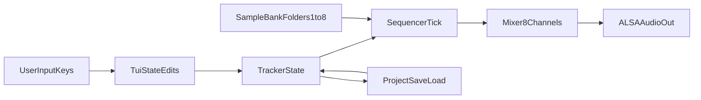

# C Linux Tracker MVP Plan

## Scope and Decisions
- Language/runtime: C on Linux.
- Audio backend: ALSA-only playback/mixing.
- First version: MVP sequencing workflow first; effects can be scaffolded with minimal implementation hooks.

## Architecture
- **Core modules**
  - `tracker_state`: song/project model (tempo, patterns, steps, channels, sample refs).
  - `sample_bank`: scan/load WAV samples from `samples/1` … `samples/8`.
  - `engine`: real-time mixer and sequencer clock, 8 channels, per-step pitch/volume.
  - `tui`: ncurses ASCII+color interface for pattern editing, transport, sample selection.
  - `project_io`: save/load projects in a stable text format (JSON-like or INI-like custom format).
- **Data flow**

## Planned Files
- Build and docs:
  - [`C:/Users/AndreasKrautwald/OneDrive - Creative United ApS/Documents/Projekter/Trakkit/trakkit/README.md`](C:/Users/AndreasKrautwald/OneDrive - Creative United ApS/Documents/Projekter/Trakkit/trakkit/README.md)
  - [`C:/Users/AndreasKrautwald/OneDrive - Creative United ApS/Documents/Projekter/Trakkit/trakkit/Makefile`](C:/Users/AndreasKrautwald/OneDrive - Creative United ApS/Documents/Projekter/Trakkit/trakkit/Makefile)
- Source:
  - [`C:/Users/AndreasKrautwald/OneDrive - Creative United ApS/Documents/Projekter/Trakkit/trakkit/src/main.c`](C:/Users/AndreasKrautwald/OneDrive - Creative United ApS/Documents/Projekter/Trakkit/trakkit/src/main.c)
  - [`C:/Users/AndreasKrautwald/OneDrive - Creative United ApS/Documents/Projekter/Trakkit/trakkit/src/tui.c`](C:/Users/AndreasKrautwald/OneDrive - Creative United ApS/Documents/Projekter/Trakkit/trakkit/src/tui.c)
  - [`C:/Users/AndreasKrautwald/OneDrive - Creative United ApS/Documents/Projekter/Trakkit/trakkit/src/tui.h`](C:/Users/AndreasKrautwald/OneDrive - Creative United ApS/Documents/Projekter/Trakkit/trakkit/src/tui.h)
  - [`C:/Users/AndreasKrautwald/OneDrive - Creative United ApS/Documents/Projekter/Trakkit/trakkit/src/engine.c`](C:/Users/AndreasKrautwald/OneDrive - Creative United ApS/Documents/Projekter/Trakkit/trakkit/src/engine.c)
  - [`C:/Users/AndreasKrautwald/OneDrive - Creative United ApS/Documents/Projekter/Trakkit/trakkit/src/engine.h`](C:/Users/AndreasKrautwald/OneDrive - Creative United ApS/Documents/Projekter/Trakkit/trakkit/src/engine.h)
  - [`C:/Users/AndreasKrautwald/OneDrive - Creative United ApS/Documents/Projekter/Trakkit/trakkit/src/sample_bank.c`](C:/Users/AndreasKrautwald/OneDrive - Creative United ApS/Documents/Projekter/Trakkit/trakkit/src/sample_bank.c)
  - [`C:/Users/AndreasKrautwald/OneDrive - Creative United ApS/Documents/Projekter/Trakkit/trakkit/src/sample_bank.h`](C:/Users/AndreasKrautwald/OneDrive - Creative United ApS/Documents/Projekter/Trakkit/trakkit/src/sample_bank.h)
  - [`C:/Users/AndreasKrautwald/OneDrive - Creative United ApS/Documents/Projekter/Trakkit/trakkit/src/project_io.c`](C:/Users/AndreasKrautwald/OneDrive - Creative United ApS/Documents/Projekter/Trakkit/trakkit/src/project_io.c)
  - [`C:/Users/AndreasKrautwald/OneDrive - Creative United ApS/Documents/Projekter/Trakkit/trakkit/src/project_io.h`](C:/Users/AndreasKrautwald/OneDrive - Creative United ApS/Documents/Projekter/Trakkit/trakkit/src/project_io.h)
  - [`C:/Users/AndreasKrautwald/OneDrive - Creative United ApS/Documents/Projekter/Trakkit/trakkit/src/tracker_state.h`](C:/Users/AndreasKrautwald/OneDrive - Creative United ApS/Documents/Projekter/Trakkit/trakkit/src/tracker_state.h)
- Assets/examples:
  - [`C:/Users/AndreasKrautwald/OneDrive - Creative United ApS/Documents/Projekter/Trakkit/trakkit/samples/1`](C:/Users/AndreasKrautwald/OneDrive - Creative United ApS/Documents/Projekter/Trakkit/trakkit/samples/1) … [`C:/Users/AndreasKrautwald/OneDrive - Creative United ApS/Documents/Projekter/Trakkit/trakkit/samples/8`](C:/Users/AndreasKrautwald/OneDrive - Creative United ApS/Documents/Projekter/Trakkit/trakkit/samples/8)

## Implementation Steps
- Scaffold project structure, compile pipeline, and dependency notes (`libasound2-dev`, `libncurses-dev`).
- Define tracker data model: 8 channels, pattern grid, step events (`sample_index`, `note`, `volume`, `effect`).
- Implement WAV loader (PCM16 mono/stereo), folder scanning by channel, and in-memory sample buffers.
- Implement ALSA output thread + mixer with per-voice resampling for pitch changes and gain for volume.
- Build ncurses UI with colored channel lanes, cursor editing, playback controls, and status/help line.
- Add project save/load format and commands (`:save`, `:load` or keybindings).
- Add effect scaffolding with MVP implementation:
  - Distortion: soft clip per channel.
  - Low/high-pass: 1-pole filters.
  - Reverb: simple feedback delay network placeholder.
- Validate by compiling and running a local test song using sample folders 1-8.

## Acceptance Criteria
- Runs in Linux terminal and shows colored ASCII tracker UI.
- Loads WAV samples from exactly 8 channel folders.
- Plays back 8 simultaneous channels with editable pitch/volume per step.
- Can save and load project files with consistent playback results.
- Basic effects are available in code path (even if minimal quality in MVP).